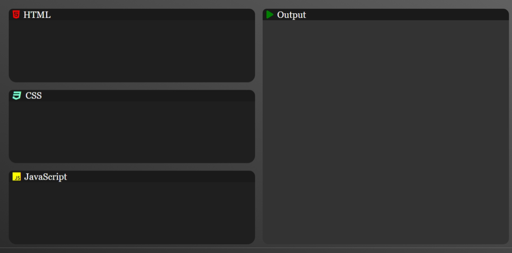
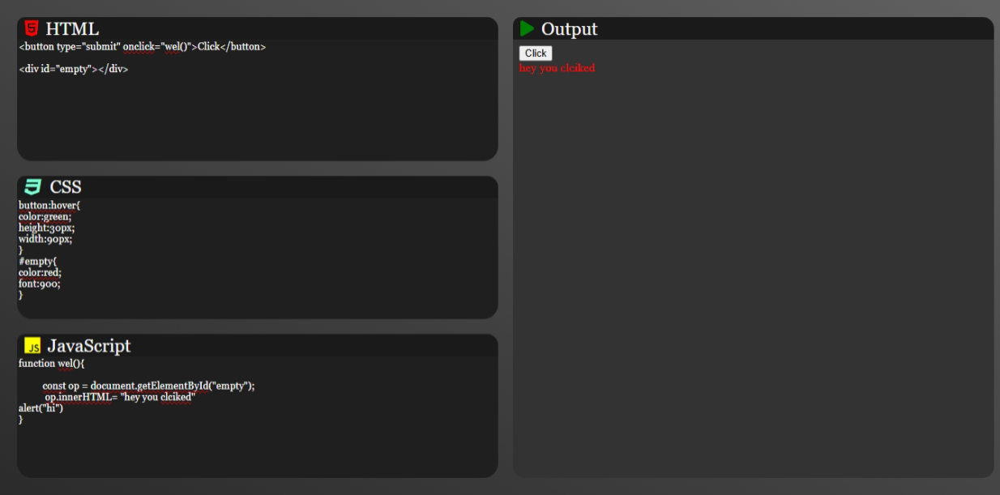

# Online Code Editor

A responsive and interactive code editor that supports live preview of HTML, CSS, and JavaScript code. Built using HTML, CSS, and JavaScript with a clean UI for better coding experience.

## 🔗 Live Demo
[Click here to try the Code Editor](https://msdhinesh45.github.io/code-editor/)

## 📸 Output Screenshots

### 🔹 Output View 1

### 🔹 Output View 2

## ✨ Features
- Real-time preview of HTML, CSS, and JS
- Responsive layout with modern design
- Font Awesome icons for better UI
- Simple and beginner-friendly interface

## 🛠️ Technologies Used
- HTML5
- CSS3
- JavaScript (Vanilla)
- Font Awesome CDN

## 📂 How to Use
1. Enter your HTML, CSS, and JS code in the respective editors.
2. View the live output on the right panel.
3. The output updates automatically as you type.

## 📬 Feedback
Feel free to open issues or submit pull requests for suggestions or improvements.
